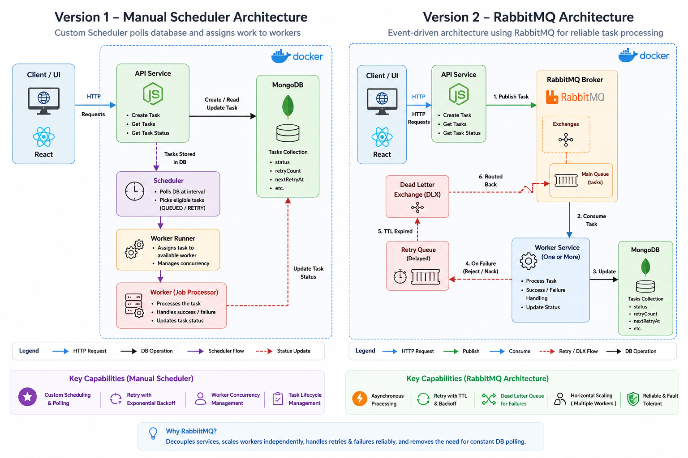
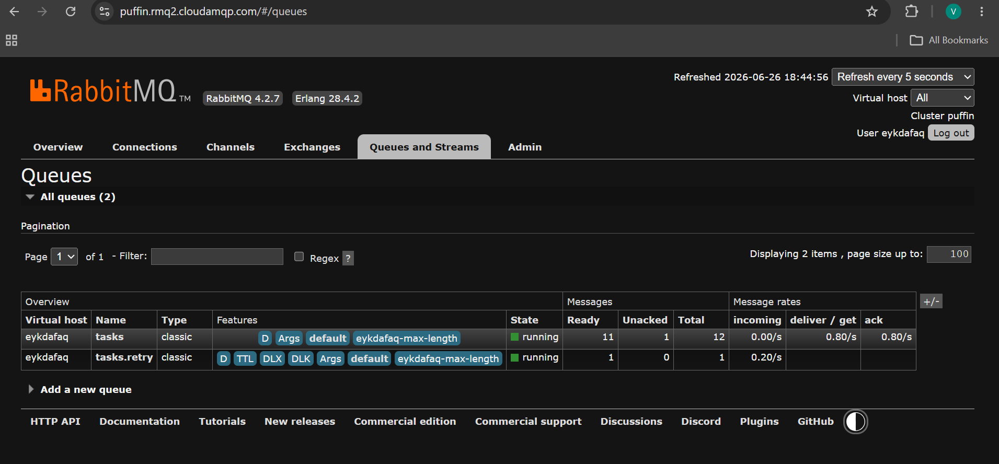

## Project Architecture


## RabbitMQ Dashboard


# Distributed Task Scheduler

This project uses RabbitMQ to separate task submission from task execution.

```text
client -> server API -> RabbitMQ -> worker(s) -> MongoDB
```
# DEPLOYMENT ARCHITECTURE
Frontend (Vercel)
        │
        ▼
Render API (Docker)
        │
        ▼
CloudAMQP
        │
        ▼
Render Worker (Docker)
        │
        ▼
MongoDB Atlas

## Run it

Start RabbitMQ from the project root:

```bash
docker compose up -d
```

Copy `server/.env.example` to `server/.env`, then use three terminals (or use run concurrency):

```bash
cd server
npm install
npm run dev
```

```bash
cd server
npm run dev:worker
```

```bash
cd client
npm install
npm start
```

Start additional `npm run worker` processes to see RabbitMQ distribute tasks
between consumers. Open `http://localhost:15672` with `guest` / `guest` to
inspect the queues.

See [server/README.md](server/README.md) for retry and demo settings.
