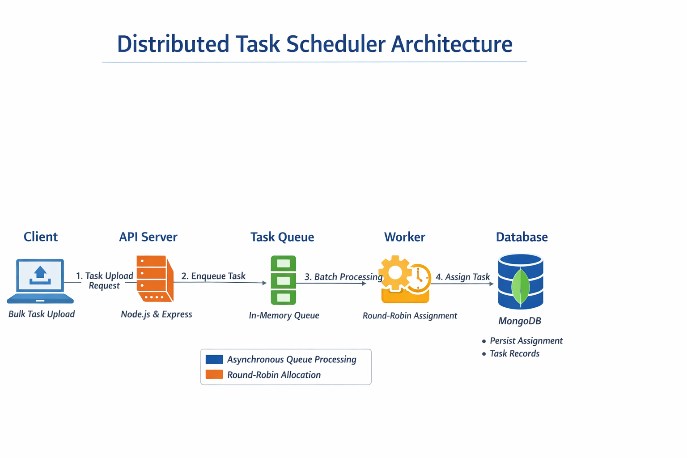

# Distributed Task Scheduler (Backend)

## Overview
A backend system designed to handle bulk task ingestion and distribute tasks across agents using a **persistent round-robin scheduling algorithm**.

The system uses **asynchronous queue-based processing** to ensure non-blocking and scalable task handling.

---

## Key Features

- Persistent Round-Robin Scheduling (fair task distribution)
- Asynchronous Queue-Based Processing (non-blocking requests)
- Batch Processing for efficient database operations
- Role-Based Authentication (Admin / Agent)
- Bulk Task Upload via Excel
- MVC Architecture

---

## System Design

### Flow
Client → API → Queue → Worker → Round-Robin → Database

### Explanation
- Tasks are pushed into an in-memory queue
- A background worker processes tasks in batches
- Each task is assigned to agents in cyclic order
- Assignment state is stored in MongoDB to maintain continuity across requests

---

## Tech Stack

- Node.js
- Express.js
- MongoDB (Mongoose)

---

## Getting Started

### Install dependencies
    npm install

### Setup environment variables
Create `.env` file:
- PORT=8080
- MONGO_URI=your_mongodb_uri
- DEV_MODE=development

### Run server
    npm start

---

## ⚠️ Limitations
- Queue is currently **in-memory** (data loss on restart)
- Can be extended using **Redis/Kafka**

---

## Future Improvements
- Persistent queue (Redis)
- Horizontal scaling with multiple workers
- Retry mechanism for failed tasks
---

## Key Learnings
- Designing async systems using queue + worker
- Implementing fair scheduling using round-robin
- Efficient bulk processing using batching    